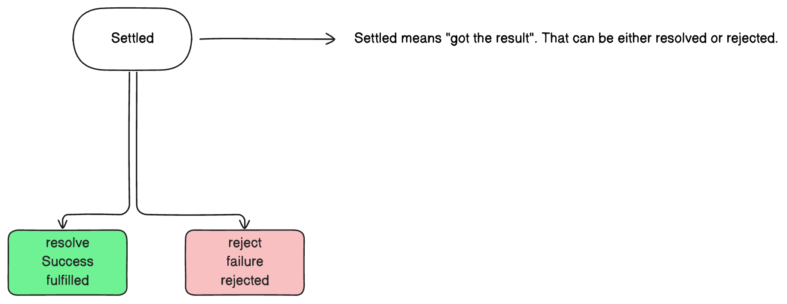
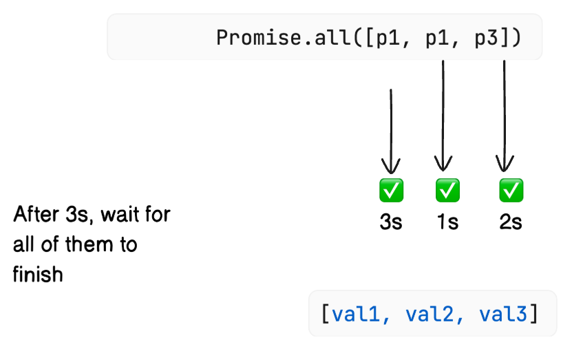
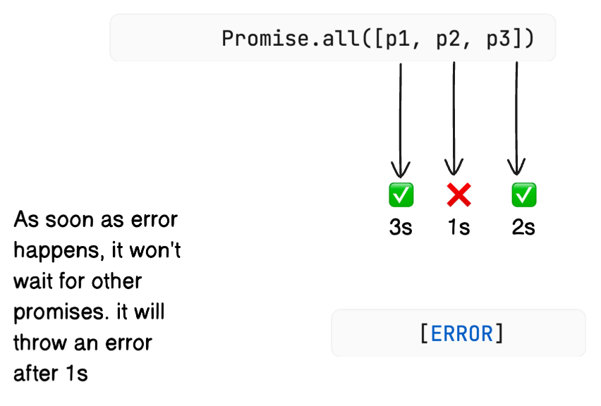
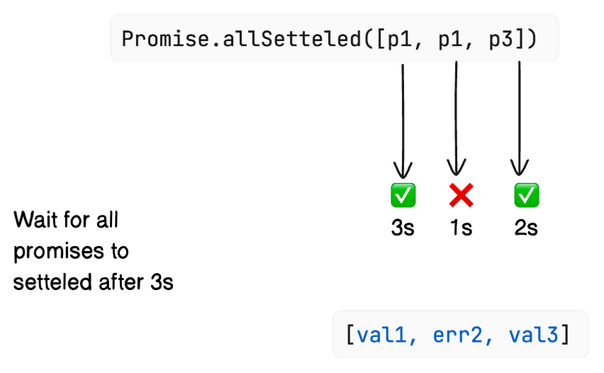
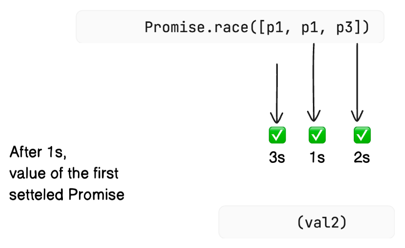
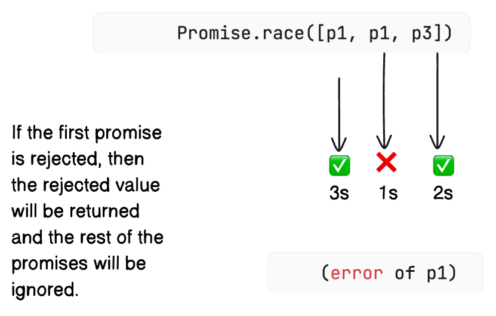
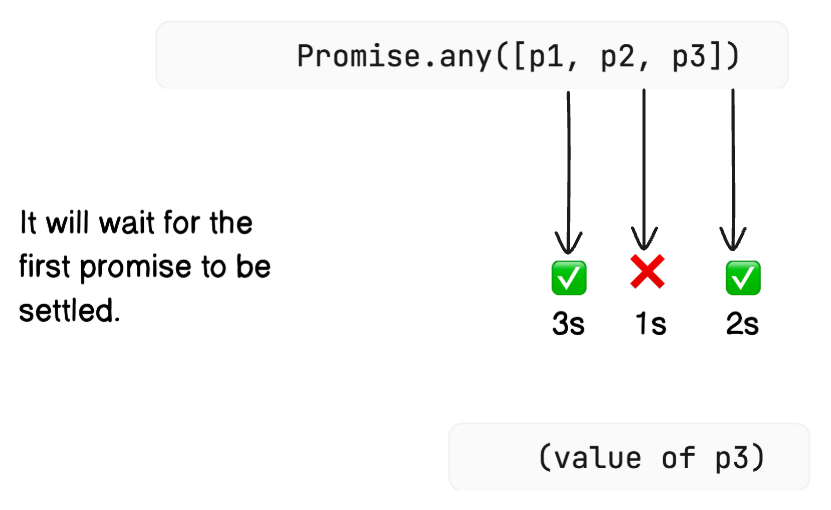
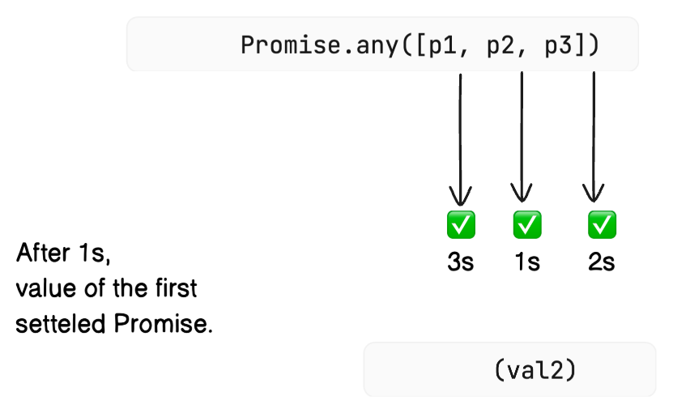
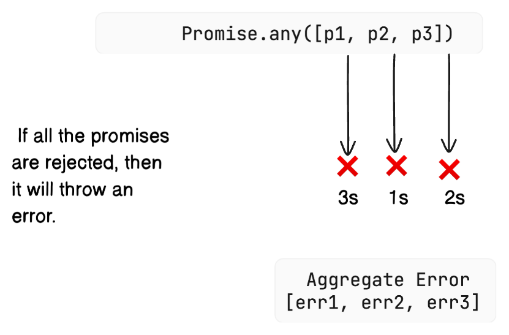
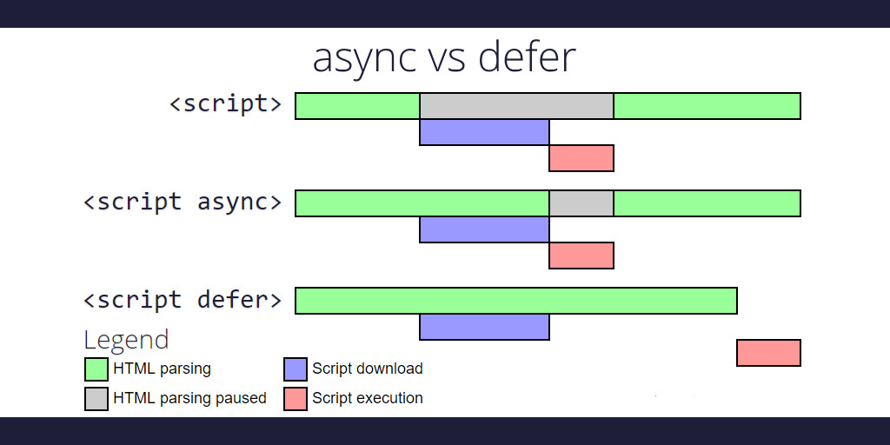

# Time, tide and JavaScript wait for none

### Promise: Static Methods
 > Note: Some of the images have p1,p1,p3 but it should be p1,p2,p3. So please ignore the typo.

The term **Settled** means either resolved or rejected.


#### 1. `Promise.all` :
It will wait for all the promises to be settled. If all the promises are resolved, then the resolved values will be returned in an array. If any of the promises is rejected, then the rejected value will be returned and the rest of the promises will be ignored.





#### 2. `Promise.allSettled` :
- If all the promises are resolved, then the resolved values will be returned in an array with the status of `fulfilled`. It's equivalent to `Promise.all` in case of all promises are resolved.
- If any of the promises is rejected, it will still wait for the rest of the promises to be settled. The resolved values will be returned in an array with the status of `fulfilled` and the rejected values will be returned in an array with the status of `rejected`.



#### 3. `Promise.race` :
Which ever promise is settled first, that promise will be returned. If the first promise is rejected, then the rejected value will be returned and the rest of the promises will be ignored.





#### 4. `Promise.any` :
If the first promise is resolved, then the resolved value will be returned and the rest of the promises will be ignored. If the first promise is rejected, then it will wait for the next promise to be settled. If all the promises are rejected, then it will throw an error.

    - > It's a success seeking race.
    - > fulfills when any of the input's promises fulfills, with this first fulfillment value.
    - > It rejects when all of the input's promises reject (including when an empty iterable is passed)








### Async/Await
- `async` function always returns a promise.
- `await` keyword is used to wait for a promise to be settled.
- `await` keyword can only be used inside an `async` function.
- As soon as the `await` keyword is encountered, the control is transferred to the caller function. Once the promise is settled, the control is transferred back to the `async` function. This means async function pops out of the call stack and the control is transferred to the caller function. Once the promise is settled, the async function is pushed back to the call stack. This is the reason why the async function is non-blocking.
- `try` and `catch` should be used for error handling.

### Async await vs Promise.then/.catch
- `async/await` is just a syntactic sugar over `Promise.then/.catch`.
- `async/await` is more readable and easy to understand.

### Async vs Defer in script tag



### How get `sum(1)(2)(3)(4)...(n)` ?
```javascript
let sum = a => b => typeof (b) === 'undefined' ? a : sum(a + b);

console.log(sum(2)(3)(4)());
```
Which is equivalent to
```javascript
let sum = function(a) {
    return function(b) {
        if(typeof b === 'undefined') {
            return a;
        } else {
            return sum(a + b);
        }
    }
}
```