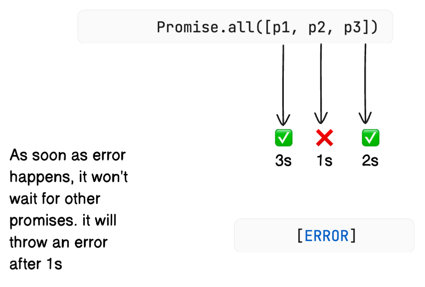
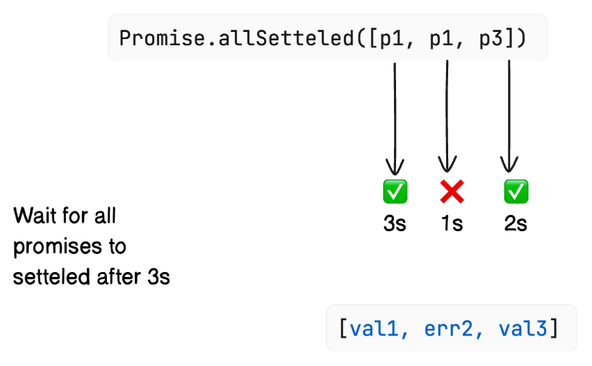
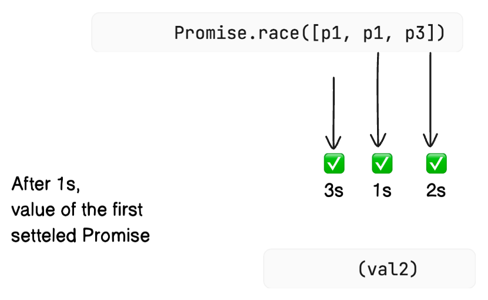
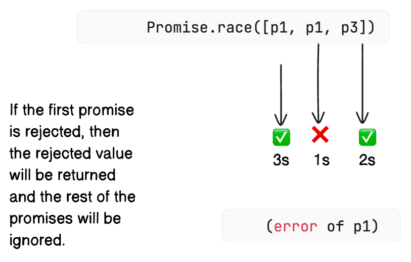
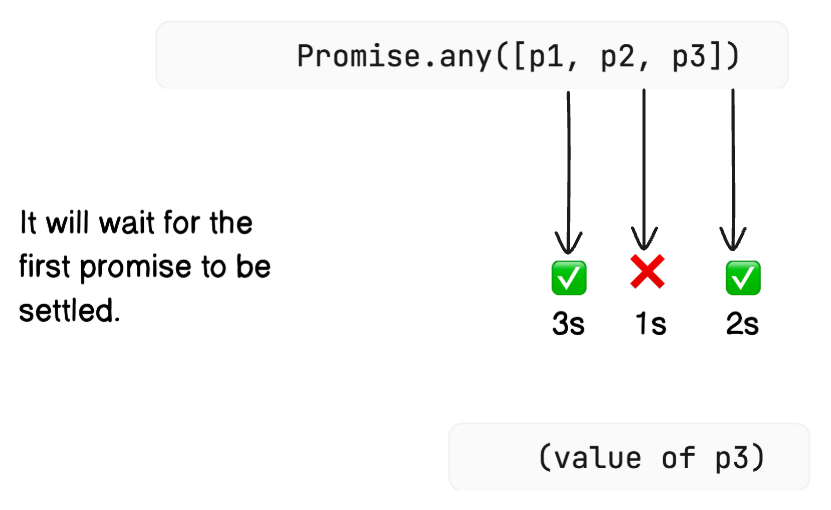
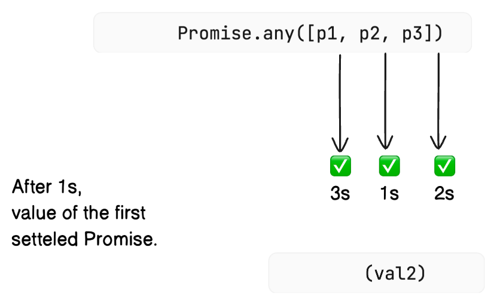
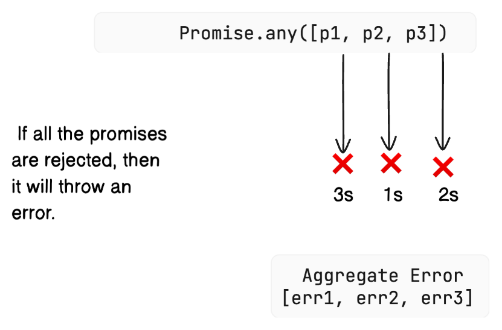

### Promise: Static Methods
#### 1. `Promise.all` :
It will wait for all the promises to be settled. If all the promises are resolved, then the resolved values will be returned in an array. If any of the promises is rejected, then the rejected value will be returned and the rest of the promises will be ignored.

#### 2. `Promise.allSettled` :
- If all the promises are resolved, then the resolved values will be returned in an array with the status of `fulfilled`. It's equivalent to `Promise.all` in case of all promises are resolved.
- If any of the promises is rejected, it will still wait for the rest of the promises to be settled. The resolved values will be returned in an array with the status of `fulfilled` and the rejected values will be returned in an array with the status of `rejected`.

#### 3. `Promise.race` :
Which ever promise is settled first, that promise will be returned. If the first promise is rejected, then the rejected value will be returned and the rest of the promises will be ignored.

4. `Promise.any` :
It will wait for the first promise to be settled. If the first promise is resolved, then the resolved value will be returned and the rest of the promises will be ignored. If the first promise is rejected, then it will wait for the next promise to be settled. If all the promises are rejected, then it will throw an error.

    > It's a success seeking race.

